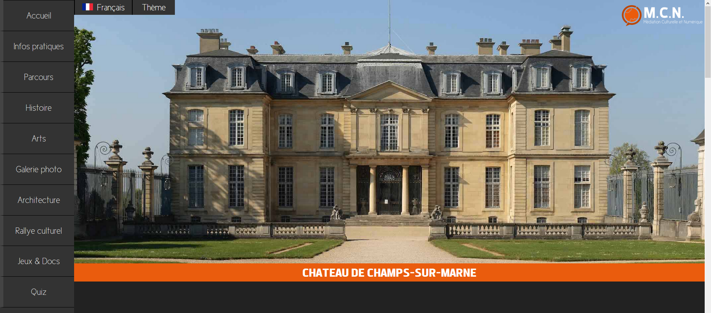
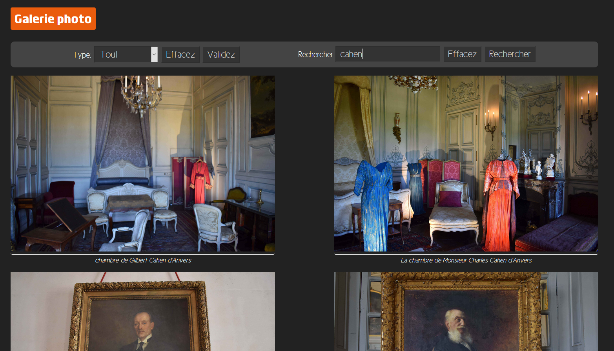

# Site web du château de Champs-sur-marne

Ce site web est un projet de DUT informatique 1ère année qui se déroule toute l'année. Le principe de ce projet est de promouvoir la culture locale et d'attirer de nouveaux visiteurs. Il nous a permis de développer nos compétences en programmation, communication, anglais et encore gestion de projet.

Le site est en ce moment disponible en ligne sur ce [(lien.)](http://perso-etudiant.u-pem.fr/~vbuisset/html/fr/main.php)

## L'équipe
 - Ewen Bouquet   [(Profil Github)](https://github.com/iFairPlay22)
 - Vincent Buisset [(Profil Github)](https://github.com/Pholith)
 - Julien Faidide [(Site de présentation)](https://julien-faidide.pagesperso-orange.fr/)

## Aperçu

